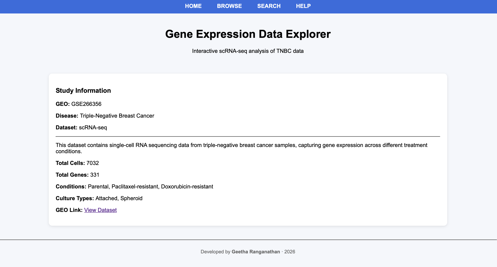
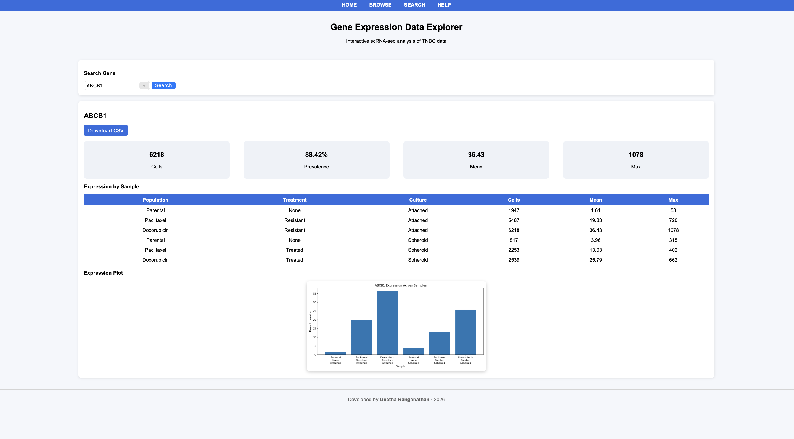

# 🧬 Gene Expression Data Explorer

Interactive web application for exploring single-cell RNA sequencing (scRNA-seq) gene expression data.

---

## 🚀 Overview

This project is a Flask-based web application that allows users to:

- 🔍 Search for genes (e.g., ABCB1, ABCG2)
- 📊 View gene expression summary metrics
- 📋 Explore expression across samples
- 📈 Visualize expression with plots
- ⬇️ Download data as CSV

---

## 📂 Dataset Information

- **GEO Accession:** GSE266356  
- **Disease:** Triple-Negative Breast Cancer (TNBC)  
- **Data Type:** Single-cell RNA-seq  

This dataset contains gene expression profiles from TNBC samples under different treatment conditions.

---

## 🧠 Features

- 🔍 Gene search functionality  
- 📊 Summary metrics:
  - Total expressing cells  
  - Prevalence (%)  
  - Mean expression  
  - Max expression  
- 📋 Sample-level expression table  
- 📈 Expression plot visualization  
- ⬇️ CSV download for gene-specific data  

---

## 🛠 ️ Tech Stack

- **Backend:** Flask (Python)  
- **Database:** SQLite  
- **Visualization:** Matplotlib  
- **Frontend:** HTML, CSS  

---

## ▶️ How to Run Locally

```bash
# Clone the repository
git clone https://github.com/Geethalab/gene-expression-data-explorer.git
  
# Navigate to project
cd gene-expression-data-explorer

# Run the app
python app/app.py
```


Then open in your browser:

👉 http://127.0.0.1:5000

---

## 📸 Screenshots

### Home Page


### Gene Search

